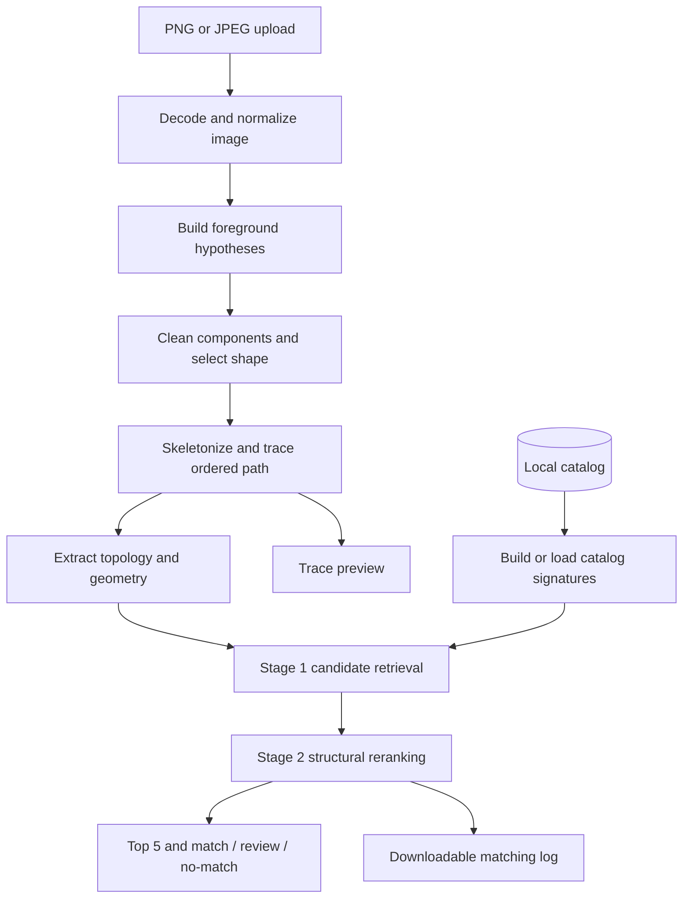

# BBS Rebar Matching

An image-based shape matching system that compares hand-drawn sketches and screenshots with a CUBE shape catalog. It extracts foregrounds and skeletons, analyses bends, arcs, crossings and segment geometry, and ranks candidate matches. The Streamlit interface shows the top five results, confidence, extracted traces and downloadable logs for review.

> **Status:** engineering prototype. The code and demo can be explored here, but the synthetic examples do not establish recognition accuracy on real drawings. A result is decision support, not dimensional verification or engineering approval.

## What the project does

The application accepts PNG or JPEG images containing one bar shape and returns ranked candidates from a local catalog. It is built with Python, Streamlit, OpenCV, scikit-image, NetworkX, NumPy and Pillow.

- Deterministic image processing; no external AI service, trained classifier or OCR is used.
- Foreground extraction handles common screenshot and photo conditions, followed by component cleanup and grouping.
- Skeleton and ordered-path previews let users inspect the geometry used by the matcher.
- Candidate comparison considers topology, bends, trajectory, crossings, straight segments and circular arcs.
- Rotation, uniform scale and traversal reversal are handled. Reflection and nonuniform stretching are not treated as equivalent.
- The result view reports the Top 5, structural distance, geometric fit, heuristic confidence, review status and a downloadable per-image JSON log.
- Uploads and previews are processed in temporary files and session memory; normal matching does not create a permanent image archive.

## How matching works



1. **Decode and prepare:** correct image orientation, composite transparency, and evaluate plausible foreground masks for dark or coloured strokes.
2. **Extract the shape:** remove obvious borders and small noise, group related stroke fragments, skeletonize the selected foreground, and build a pixel graph.
3. **Trace and describe:** order the path where supported, measure trace coverage, resample it, and calculate endpoints, junctions, loops, turns, bend order, headings, trajectory and line/arc features.
4. **Retrieve candidates:** compare the query signature against the local catalog and form a shortlist using structural evidence.
5. **Rerank and explain:** compare the shortlisted paths in more detail, rank by structural distance, assess geometric fit and ambiguity, and return a candidate, review, or no-match result.

The matcher is a geometry-based retrieval pipeline, not a general graph-edit solver. Candidate ranking cannot recover an item omitted from the first-stage shortlist.

## How the implementation evolved

Development has focused on making the extracted geometry and ranking easier to inspect and less brittle:

- Image decoding was hardened for orientation, transparency, grayscale, high-bit-depth images and non-ASCII file paths.
- Foreground processing was expanded to consider multiple thresholding and contrast hypotheses, with border and component cleanup.
- Skeleton tracing and coverage checks were added so incomplete or unsupported paths can be surfaced for review rather than silently treated as complete.
- Geometry features were refined to preserve terminal details, count turns consistently, distinguish finite line segments from collinear returns, and compare arc presence and sweep.
- Candidate scoring combines global shape and local structural evidence; confidence and decision status are computed separately from ranking.
- Structured processing events and downloadable logs were added to help explain extraction, candidate scores and decisions without saving uploaded image pixels to ordinary logs.
- Focused tests were added around transformations, tracing, ranking, confidence boundaries, image decoding and UI states.

These changes establish implementation behaviour, not measured improvements in real-world accuracy. A representative, engineer-labelled evaluation set is still needed to quantify performance.

## Public demo and data boundary

This public repository contains three **generated synthetic examples** (a straight shape, an angle and a U shape) so the application can be started and explored without company catalog material.

It does **not** include a company catalog database, catalog cards or geometry, source catalog PDFs, customer images, model weights, derived company caches or private evaluation inputs. Do not add those materials to this public repository unless redistribution is explicitly authorized. The Python `.gitignore` includes rules for common local catalog and generated files; review `git status` before committing because ignore rules do not remove files that are already tracked.

The synthetic data is only a UI and pipeline smoke demo. It is not representative of a production catalog and must not be used to claim real-drawing recognition accuracy.

## Run the demo on Windows

Requires Python 3.13 and PowerShell. From the repository folder:

```powershell
python -m venv .venv
.\.venv\Scripts\python.exe -m pip install -r requirements.txt
.\.venv\Scripts\python.exe tools\create_demo_catalog.py
& .\Start-App.ps1
```

The launcher uses `demo_catalog.db` by default. The first matching run builds a small derived feature cache. Open the local URL printed by Streamlit, upload one PNG or JPEG containing a single shape, and select **Run Shape Matching**.

The generator recreates the demo database and synthetic geometry files. To point the app at a different **authorized local** catalog, set `BBS_CATALOG_DB` in PowerShell before starting the launcher:

```powershell
$env:BBS_CATALOG_DB = 'D:\path\to\authorized-catalog.db'
& .\Start-App.ps1
```

That database must use the schema and image assets expected by the matcher. Catalog onboarding, source-data validation and clean installation with an external catalog have not been validated by this public demo.

## Results and interpretation

| Status | Meaning |
| --- | --- |
| Candidate found | The leading candidate passed current fit and separation rules; verify its identity and dimensions. |
| Review required | The trace may be incomplete, the fit weak, candidates close, or geometry ambiguous. |
| No suitable match | No candidate passed the current distance rule. This does not prove that the shape is absent from a catalog. |

Lower structural distance ranks first. Fit, confidence and status are separate indicators; **confidence and fit are heuristic scores, not calibrated probabilities or accuracy percentages**. The system does not verify dimensions or replace engineering review.

### Known limitations

- Touching labels, shadows, glare, blur and perspective can change foreground extraction.
- Short hooks and terminals can be lost or misinterpreted at low resolution.
- Arbitrary crossings, gaps and over/under relationships are not fully resolved.
- A shallow arc can resemble a straight or angular path; rasterization can split or merge primitives.
- Different identities with identical geometry cannot be distinguished from shape pixels alone.
- An incomplete trace or a candidate omitted from the retrieval shortlist can lead to a wrong result.
- Multiple shapes in one image are outside the current one-shape-per-image workflow.
- Batch processing is sequential; difficult images can take time.
- Representative hand-drawn Top-1/Top-5 accuracy and calibrated confidence have not been established.

## Tests and verification

Run the focused unit and regression suite:

```powershell
.\.venv\Scripts\python.exe -m unittest discover -s tests -v
```

The current suite contains 69 tests covering geometry invariances, line/arc features, skeleton and path handling, ranking, decision boundaries, upload decoding and related regressions. The Streamlit interface is also checked with a lightweight app test. The three synthetic examples have been smoke-tested against their expected demo entries.

These checks test code behaviour and the synthetic demo only. They are **not** a benchmark of real catalog recognition or hand-drawn accuracy.

## Repository layout

```text
.
|-- app.py                       # Streamlit interface, uploads and result display
|-- matcher.py                   # Image processing, tracing, signatures and ranking
|-- shape_features.py            # Line/arc geometry and decision features
|-- Start-App.ps1                # Windows launcher; selects the synthetic demo by default
|-- requirements.txt             # Pinned Python dependencies
|-- demo_catalog.db              # Small generated synthetic catalog
|-- demo_data/geometry/          # Three generated demo shapes
|-- tools/create_demo_catalog.py # Recreates only the synthetic demo assets
`-- tests/                       # Focused unit and regression tests
```

## Privacy, logging and licensing

Uploaded images are processed through temporary files; previews, results and downloadable event details are held in Streamlit session memory. The normal matching flow does not permanently archive uploaded image pixels. Terminal logs and downloadable logs may include filenames and structural information, so review them before sharing.

The [MIT License](LICENSE) applies to the project code. Only the synthetic demo geometry is included; no company catalog material is included or licensed by this repository.
